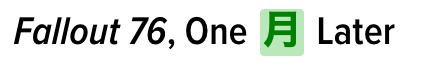

# Go Go Nihongo

A chrome extension that replaces English words with the first basic kanji or kana characters from your study book. 
The extension replaces words mentioned in the file `words.csv` with kanji.

## Running in the browser

- Download this repository. 
- Open the Chrome extensions page, enable developer mode
- Click "Load Unpacked" and choose the folder you just downloaded

## Edit the CSV file

- You can edit or replace the `words.csv` file
- The first row has column names, and will be ignored by the extension
- A word list starts with a row with the list title (ex. "JLPT4")
- Followed by rows that contain at least a column for english and one for the kanji. 

## Edit the style files

- **popup.html** has the layout and css for the little popup window
- **style.css** has the styles that show kanji and a tooltip in all html pages

After editing, upgrade the version number in the `manifest.json` file, this should automatically update the extension in chrome.

## TODO

- [ ] Improve extension icon
- [ ] Improve styling, toolip for the kanji
- [ ] Improve style, layout for popup menu
- [ ] Create one CSV with jlpt5, jlpt4, etc
- [x] Create popup menu
- [x] User can select which JLPT list to use
- [ ] Put extension in the chrome store
- [ ] Show "translating" message while working

## Credits

The extension uses [Find and replace DOM text](https://github.com/padolsey/findAndReplaceDOMText) and [Papa Parse](https://github.com/mholt/PapaParse).